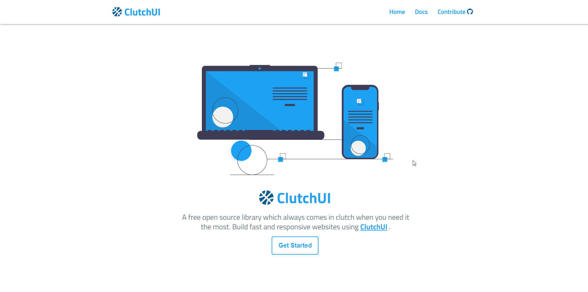

#  ClutchUI

A free open source library which always comes in clutch when you need it the most. Build fast and responsive websites using [ClutchUI](https://clutchui.netlify.app/).

## Installation

In order to start using the ClutchUI in your projects, just copy code snippet below. Make sure to paste it in your `<head>` tag and above all your `<link>` tags.

```html
<link
  rel="stylesheet"
  href="https://clutchui.netlify.app/stylesheets/index.css"
/>
```

<hr />
    
## Starter Template

Here's a simple starter template to get you started.

```html
<html>
  <head>
    <meta charset="utf-8" />
    <meta name="viewport" content="width=device-width, initial-scale=1" />

    //ClutchUI CSS

    <link
      rel="stylesheet"
      href="https://clutchui.netlify.app/stylesheets/index.css/"
    />

    //Your stylesheets here

    <title>Starter Template</title>
  </head>
  <body>
    <h1>Hello World</h1>

    <h2>Let's Clutch it!!</h2>

    <script src="https://clutchui.netlify.app/docs/js/sidebar.js"></script>
    <script src="https://clutchui.netlify.app/docs/js/nav.js"></script>
  </body>
</html>
```

<hr />

## Components

<ol>
    <li><a href="https://clutchui.netlify.app/docs/alert/alert.html">Alerts</a></li>
    <li><a href="https://clutchui.netlify.app/docs/avatar/avatar.html">Avatar</a></li>
    <li><a href="https://clutchui.netlify.app/docs/badge/badge.html">Badge</a></li>
    <li><a href="https://clutchui.netlify.app/docs/button/button.html">Button</a></li>
    <li><a href="https://clutchui.netlify.app/docs/card/card.html">Card</a></li>
    <li><a href="https://clutchui.netlify.app/docs/grid/grid.html">Grid</a></li>
    <li><a href="https://clutchui.netlify.app/docs/image/image.html">Image</a></li>
    <li><a href="https://clutchui.netlify.app/docs/input/input.html">Input</a></li>
    <li><a href="https://clutchui.netlify.app/docs/list/list.html">List</a></li>
    <li><a href="https://clutchui.netlify.app/docs/modal/modal.html">Modal</a></li>
    <li><a href="https://clutchui.netlify.app/docs/navigation/navigation.html">Navigation</a></li>
    <li><a href="https://clutchui.netlify.app/docs/rating/rating.html">Rating</a></li>
    <li><a href="https://clutchui.netlify.app/docs/typography/typography.html">Typography</a></li>
    <li><a href="https://clutchui.netlify.app/docs/snackbar/snackbar.html">Snackbar</a></li>
</ol>

<hr />

## Brief overview of components

ClutchUI provides the following components.

### Alerts

An alert is a simple block of useful information that is used to display and get the user's attention.

Types of alert:

<ul>
<li><a href="https://clutchui.netlify.app/docs/alert/alert.html#simple-alert">Simple Alert</a></li>
<li><a href="https://clutchui.netlify.app/docs/alert/alert.html#icon-alert">Alert with icon</a></li>
<li><a href="https://clutchui.netlify.app/docs/alert/alert.html#border-alert">Alert with border</a></li>
<li><a href="https://clutchui.netlify.app/docs/alert/alert.html#dismiss-alert">Alert with dismiss</a></li>
</ul>

<hr />

### Avatar

An avatar is mini user profile image which is used to give an identity to the user.

Types of avatar:

<ul>
<li><a href="https://clutchui.netlify.app/docs/avatar/avatar.html#avatar-round">Round Avatar</a></li>
<li><a href="https://clutchui.netlify.app/docs/avatar/avatar.html#avatar-size">Avatar Sizes</a></li>
<li><a href="https://clutchui.netlify.app/docs/avatar/avatar.html#avatar-square">Square Avatar</a></li>
<li><a href="https://clutchui.netlify.app/docs/avatar/avatar.html#avatar-rounded">Rounded Avatar (Rounded corners)</a></li>
</ul>

<hr />

### Badge

Badges are commonly used to display status information such as notification count or user status.

Types of badges:

<ul>
<li><a href="https://clutchui.netlify.app/docs/badge/badge.html#badge-avatar">Badge for Avatar</a></li>
<li><a href="https://clutchui.netlify.app/docs/badge/badge.html#badge-sizes">badge Sizes</a></li>
<li><a href="https://clutchui.netlify.app/docs/badge/badge.html#badge-position">Badge Positioning</a></li>
<li><a href="https://clutchui.netlify.app/docs/badge/badge.html#badge-icon">Badge with icon</a></li>
<li><a href="https://clutchui.netlify.app/docs/badge/badge.html#badge-status">Badge with status</a></li>
</ul>

<hr />

### Button

Buttons are essential part of any website. They are commonly used to interact and get feedback from the user.

Types of buttons:

<ul>
<li><a href="https://clutchui.netlify.app/docs/button/button.html#button-size">Button Sizes</a></li>
<li><a href="https://clutchui.netlify.app/docs/button/button.html#button-types">Types of Button</a></li>
<li><a href="https://clutchui.netlify.app/docs/button/button.html#button-outline">Buttons with outline</a></li>
<li><a href="https://clutchui.netlify.app/docs/button/button.html#button-disabled">Disabled Buttons</a></li>
<li><a href="https://clutchui.netlify.app/docs/button/button.html#button-icon-link">Buttons with link and icon</a></li>
</ul>

<hr />

### Card

Cards are generally used for conveying short or brief information about certain product. Cards are commonly used in e-commerce websites to showcase their wide variety for products.

Types of cards:

<ul>
<li><a href="https://clutchui.netlify.app/docs/card/card.html#card--horizontal">Horizontal card</a></li>
<li><a href="https://clutchui.netlify.app/docs/card/card.html#card--vertical">Vertical card</a></li>
<li><a href="https://clutchui.netlify.app/docs/card/card.html#card--text">Card with text</a></li>
<li><a href="https://clutchui.netlify.app/docs/card/card.html#card-overlay">Card with text-overlay</a></li>
<li><a href="https://clutchui.netlify.app/docs/card/card.html#card-dismiss">Card with dismiss</a></li>
<li><a href="https://clutchui.netlify.app/docs/card/card.html#card-badge">Card with badge</a></li>
</ul>

<hr />

### Grid

Grids are one of the basic cornerstones for layouts in web. They are used to structure the web page and make them visually appleaing.

Types of grid:

<ul>
<li><a href="https://clutchui.netlify.app/docs/grid/grid.html#grids-equal">Equal Grids</a></li>
<li><a href="https://clutchui.netlify.app/docs/grid/grid.html#grids-percentage">Split Grids</a></li>
</ul>

<hr />

### Image

Images are everywhere on the internet. With ClutchUI, implementing images so much more easier than before.

Types of Image:

<ul>
<li><a href="https://clutchui.netlify.app/docs/image/image.html#image-round">Round Image</a></li>
<li><a href="https://clutchui.netlify.app/docs/image/image.html#image-square">Square Image</a></li>
<li><a href="https://clutchui.netlify.app/docs/image/image.html#image-corner">Cornered Image</a></li>
<li><a href="https://clutchui.netlify.app/docs/image/image.html#image-responsive">Responsive Image</a></li>
</ul>

<hr />

### Input

Inputs are mainly used in Login or Sign-up forms and other general use cases.

Types of Input:

<ul>
<li><a href="https://clutchui.netlify.app/docs/input/input.html#input-default">Simple input</a></li>
<li><a href="https://clutchui.netlify.app/docs/input/input.html#input-size">Input sizes</a></li>
<li><a href="https://clutchui.netlify.app/docs/input/input.html#input-shape">Input shapes</a></li>
<li><a href="https://clutchui.netlify.app/docs/input/input.html#input-types">Input types</a></li>
<li><a href="https://clutchui.netlify.app/docs/input/input.html#input-validation">Input validation</a></li>
<li><a href="https://clutchui.netlify.app/docs/input/input.html#textarea">Textarea</a></li>
</ul>

<hr />

### List

Lists are used to group together similar items.

Types of List:

<ul>
<li><a href="https://clutchui.netlify.app/docs/list/list.html#list-spaced">Spaced Lists</a></li>
<li><a href="https://clutchui.netlify.app/docs/list/list.html#list-stacked">Stacked Lists</a></li>
<li><a href="https://clutchui.netlify.app/docs/list/list.html#list-circle">Shaped Lists</a></li>
<li><a href="https://clutchui.netlify.app/docs/list/list.html#list-numbered">Numbered Lists</a></li>
<li><a href="https://clutchui.netlify.app/docs/list/list.html#list-alpha">Alphabetical Lists</a></li>
</ul>

<hr />

### Modal

Modals are generally used to display some information to the user and requires some action from the user to proceed.

You can check it out [here](https://clutchui.netlify.app/docs/modal/modal.html).

<hr />

### Navigation

Navigation are essential part of any website. With ClutchUI you can build quick and easy navigation sections.

You can check it out [here](https://clutchui.netlify.app/docs/navigation/navigation.html).

<hr />

### Rating

Ratings are a good way for the user to share their feedback or opinion on anything.

You can check it out [here](https://clutchui.netlify.app/docs/rating/rating.html).

<hr />

### Typography

Typography is an integral part of any component library. ClutchUI provides various typography class aswell as some text utilities.

Typography classes:

<ul>
<li><a href="https://clutchui.netlify.app/docs/typography/typography.html#typography-heading">Heading</a></li>
<li><a href="https://clutchui.netlify.app/docs/typography/typography.html#typography-size">Text Size</a></li>
<li><a href="https://clutchui.netlify.app/docs/typography/typography.html#image-corner">Text Alignment</a></li>
<li><a href="https://clutchui.netlify.app/docs/typography/typography.html#typography-decoration">Text Decoration</a></li>
<li><a href="https://clutchui.netlify.app/docs/typography/typography.html#typography-weight">Text Weights</a></li>
</ul>

<hr />

### Snackbar

Snackbar contains useful information about a task which is presented to the user usually on the bottom of the screen. Snackbars are displayed only for a short peroid of time and usually used to gain the users attention or to notify them.

You can check it out [here](https://clutchui.netlify.app/docs/snackbar/snackbar.html).

<hr />

## Site Overview



<hr />

## Features

- Fully Responsive
- Integrated [Carbon](https://carbon.now.sh/) for code snapshots.
